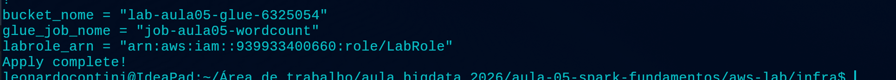
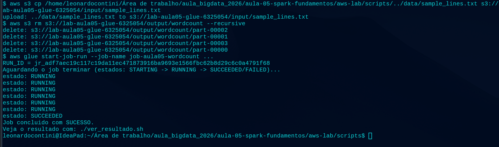
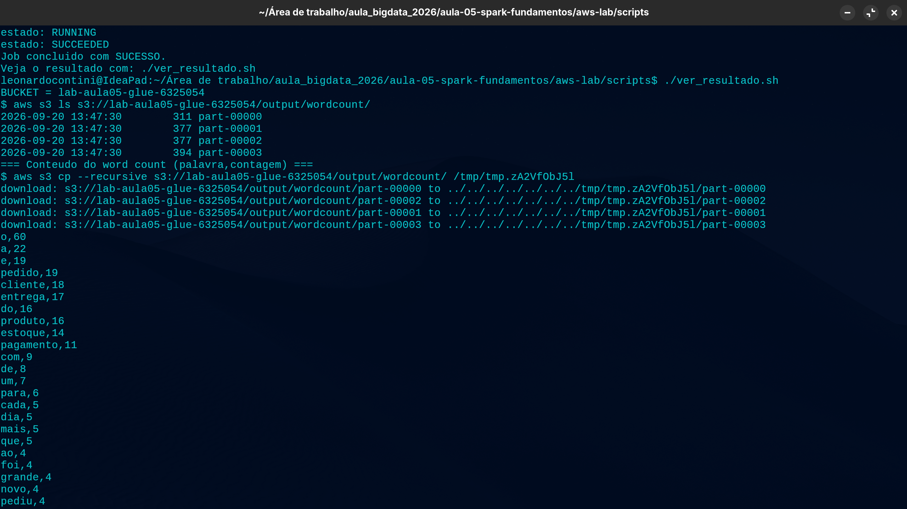
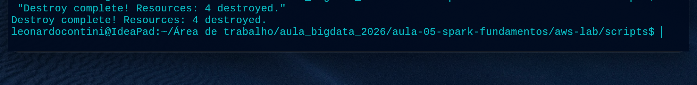

# Evidências — Lab Aula 05 (Spark RDDs na AWS)

> Copie este arquivo para `evidencias/<SEU_RA>/EVIDENCIAS.md` e preencha.
> Salve os prints na mesma pasta e referencie-os no texto.

## Identificação

- **Nome:** Leonardo Rafael Contini Costa 
- **RA:** 6325054
- **Branch:** aula-05-aws-6325054
- **Data:** 20 de setembro

---

## 1. Identidade AWS ativa

Saída de `aws sts get-caller-identity` (confirma que as credenciais do Learner
Lab estão ativas). Cole a saída no bloco de código abaixo (pode mascarar o
`Account`/`UserId`).

**Comando:**
```bash
aws sts get-caller-identity
```

Cole aqui a saída:
```text
    "UserId": "AROA5VWDFPZKPXK5BTB5D:user5367881=Leonardo_Rafael_Contini_Costa_",
    "Account": "939933400660",
    "Arn": "arn:aws:sts::939933400660:assumed-role/voclabs/user5367881=Leonardo_Rafael_Contini_Costa_"
```

---

## 2. `terraform apply` concluído

Print ou trecho final do `terraform apply` mostrando **"Apply complete!"** e os
outputs (`bucket_nome`, `glue_job_nome`, `labrole_arn`). **NÃO** mostre credenciais.

**Onde:** `cd aws-lab/infra && terraform apply`

Cole aqui a saída:
```text
bucket_nome = "lab-aula05-glue-6325054"
glue_job_nome = "job-aula05-wordcount"
labrole_arn = "arn:aws:iam::939933400660:role/LabRole"
Apply complete!
```

Print:



---

## 3. Job com estado SUCCEEDED (Glue)

Print/saída final do `./run_job.sh` mostrando `estado: SUCCEEDED` e o `RUN_ID`.
(Alternativa: print do console **AWS Glue → Jobs → seu job → aba Runs** com status
**Succeeded**.)

**Onde:** `cd aws-lab/scripts && ./run_job.sh`

Cole aqui a saída:
```text
/home/leonardocontini/Área de trabalho/aula_bigdata_2026/aula-05-spark-fundamentos/aws-lab/scripts/../data/sample_lines.txt s3://lab-aula05-glue-6325054/input/sample_lines.txt
upload: ../data/sample_lines.txt to s3://lab-aula05-glue-6325054/input/sample_lines.txt
$ aws s3 rm s3://lab-aula05-glue-6325054/output/wordcount --recursive
delete: s3://lab-aula05-glue-6325054/output/wordcount/part-00002
delete: s3://lab-aula05-glue-6325054/output/wordcount/part-00001
delete: s3://lab-aula05-glue-6325054/output/wordcount/part-00003
delete: s3://lab-aula05-glue-6325054/output/wordcount/part-00000
$ aws glue start-job-run --job-name job-aula05-wordcount ...
RUN_ID = jr_adf7aec19c117c19da11ec471873916ba9693e1566fbc62b8d29c6c0a4791f68
Aguardando o job terminar (estados: STARTING -> RUNNING -> SUCCEEDED/FAILED)...
estado: RUNNING
estado: RUNNING
estado: RUNNING
estado: RUNNING
estado: RUNNING
estado: RUNNING
estado: SUCCEEDED
Job concluido com SUCESSO.
Veja o resultado com: ./ver_resultado.sh
```

Print:



---

## 4. Resultado do word count

Saída do `./ver_resultado.sh` (lista do output + conteúdo `palavra,contagem`).
Cole no bloco de código abaixo.

**Onde:** `cd aws-lab/scripts && ./ver_resultado.sh`

Cole aqui a saída:
```text
leonardocontini@IdeaPad:~/Área de trabalho/aula_bigdata_2026/aula-05-spark-fundamentos/aws-lab/scripts$ ./ver_resultado.sh
BUCKET = lab-aula05-glue-6325054
$ aws s3 ls s3://lab-aula05-glue-6325054/output/wordcount/
2026-09-20 13:47:30        311 part-00000
2026-09-20 13:47:30        377 part-00001
2026-09-20 13:47:30        377 part-00002
2026-09-20 13:47:30        394 part-00003
=== Conteudo do word count (palavra,contagem) ===
$ aws s3 cp --recursive s3://lab-aula05-glue-6325054/output/wordcount/ /tmp/tmp.zA2VfObJ5l
download: s3://lab-aula05-glue-6325054/output/wordcount/part-00000 to ../../../../../../../tmp/tmp.zA2VfObJ5l/part-00000
download: s3://lab-aula05-glue-6325054/output/wordcount/part-00002 to ../../../../../../../tmp/tmp.zA2VfObJ5l/part-00002
download: s3://lab-aula05-glue-6325054/output/wordcount/part-00001 to ../../../../../../../tmp/tmp.zA2VfObJ5l/part-00001
download: s3://lab-aula05-glue-6325054/output/wordcount/part-00003 to ../../../../../../../tmp/tmp.zA2VfObJ5l/part-00003
o,60
a,22
e,19
pedido,19
cliente,18
entrega,17
do,16
produto,16
estoque,14
pagamento,11
com,9
de,8
um,7
para,6
cada,5
dia,5
mais,5
que,5
ao,4
foi,4
grande,4
novo,4
pediu,4
da,3
muitos,3
na,3
pedidos,3
pelo,3
voltou,3
antes,2
apos,2
cartao,2
chegou,2
em,2
expressa,2
fez,2
ficou,2
fila,2
fim,2
interior,2
loja,2
no,2
pix,2
prazo,2
reembolso,2
saiu,2
abastece,1
abriu,1
aceitou,1
acompanhou,1
agiliza,1
agrada,1
analise,1
antigo,1
aplicativo,1
aprova,1
aprovou,1
area,1
as,1
assim,1
atencao,1
avaliou,1
aviso,1
avisou,1
buscou,1
caiu,1
caminho,1
central,1
cidade,1
codigo,1
combinado,1
comeca,1
compra,1
conferir,1
confirma,1
confirmou,1
contou,1
cuidado,1
custa,1
datas,1
dentro,1
dessa,1
devolvido,1
diferentes,1
dividida,1
dois,1
duas,1
durante,1
elogiou,1
embalado,1
emitida,1
entende,1
entra,1
entregador,1
entregues,1
equipe,1
escolheu,1
esta,1
estava,1
exigente,1
exigiu,1
favorito,1
fechou,1
feito,1
feliz,1
fiscal,1
gestor,1
hora,1
leva,1
liberou,1
liga,1
limite,1
lojas,1
maior,1
manha,1
mas,1
mostrou,1
nota,1
online,1
outro,1
pagou,1
parado,1
parcelado,1
partes,1
pela,1
por,1
poucas,1
prepara,1
produtos,1
quando,1
quase,1
rapida,1
rapido,1
rastreio,1
recebe,1
receber,1
recusado,1
reduziu,1
relatorio,1
repos,1
reposicao,1
reserva,1
retornou,1
revisou,1
rota,1
sai,1
satisfeito,1
segue,1
separa,1
separacao,1
sistema,1
sucesso,1
tarde,1
tem,1
tempo,1
tentou,1
teve,1
time,1
troca,1
unidades,1
usaram,1
vai,1
varias,1
vendido,1
vez,1
vezes,1
via,1
```

Print (opcional):


---

## 5. Top palavras / interpretação

Cole o **TOP 5** do word count e escreva **2–3 frases** interpretando o resultado
(ex.: por que "pedido/cliente/entrega" dominam, o que isso diz sobre o texto de
e-commerce). Relacione com os conceitos de **RDD / driver / executors** da aula.

Top 5:
```text
o,60
a,22
e,19
pedido,19
cliente,18
```

Interpretação:

> As palavras mais frequentes mostram que o texto está bastante relacionado ao contexto de pedidos e clientes, com destaque para "pedido" e "cliente". O processamento foi realizado usando RDDs, com o driver coordenando a execução e os executors processando as operações de transformação e agregação, como flatMap, map e reduceByKey.

---

## 6. Logs do driver (opcional / bônus)

Print dos logs do **driver** no **CloudWatch** (grupo `/aws-glue/jobs/output`)
mostrando o `print(...)` do `rdd_job.py`.

**Onde:** AWS Glue → Jobs → seu job → aba **Runs** → selecione o run → **Output logs**
(abre o CloudWatch no grupo `/aws-glue/jobs/output`).

Print:
```

```

---

## 7. Limpeza (`terraform destroy`)

Print/trecho do `terraform destroy` com **"Destroy complete!"** confirmando que os
recursos foram removidos (guardrail de custo).

**Onde:** `cd aws-lab/infra && terraform destroy`

Cole aqui a saída:
```text
Destroy complete! Resources: 4 destroyed.
```

Print:



---

## Checklist de conferência

- [x] 1. Identidade AWS ativa (`aws sts get-caller-identity`)
- [x] 2. `terraform apply` concluído ("Apply complete!" + outputs)
- [x] 3. Job com estado `SUCCEEDED` (Glue) (+ `RUN_ID`)
- [x] 4. Resultado do word count (`./ver_resultado.sh`)
- [x] 5. Top palavras + interpretação (2–3 frases)
- [x] 6. Logs do driver (opcional / bônus)
- [x] 7. Limpeza com `terraform destroy` ("Destroy complete!")
